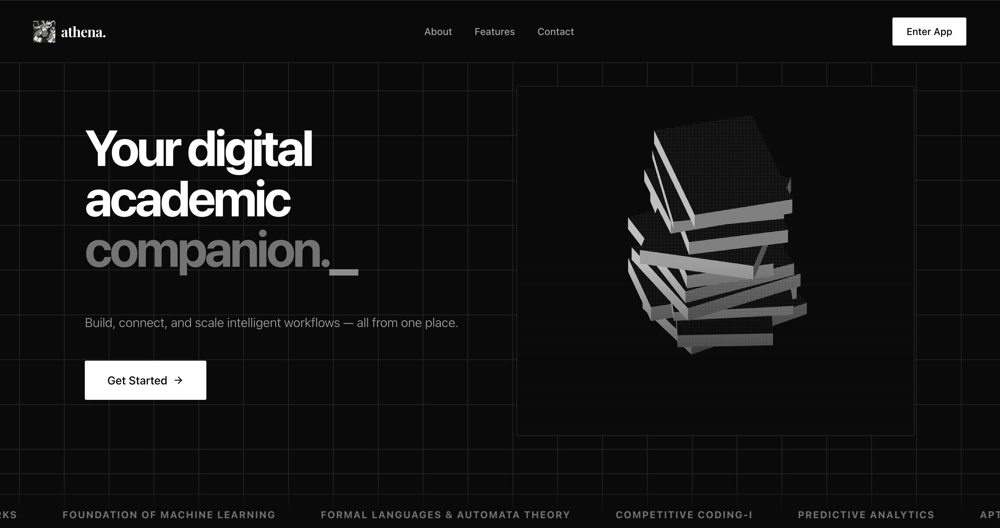
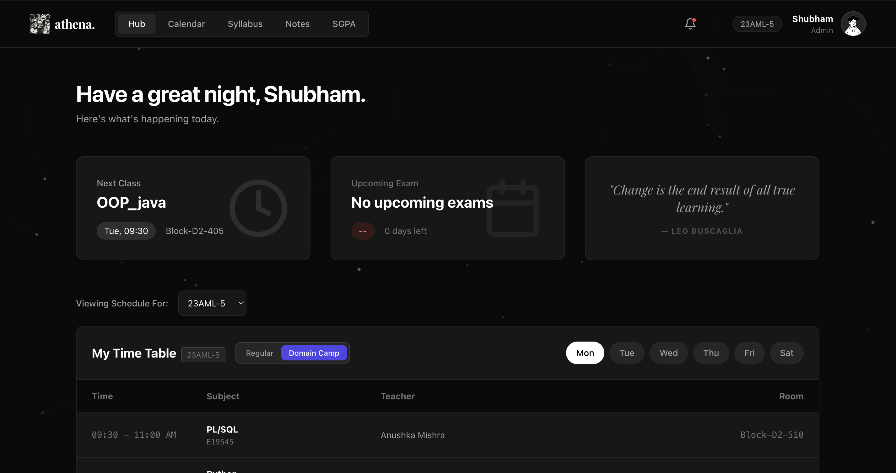
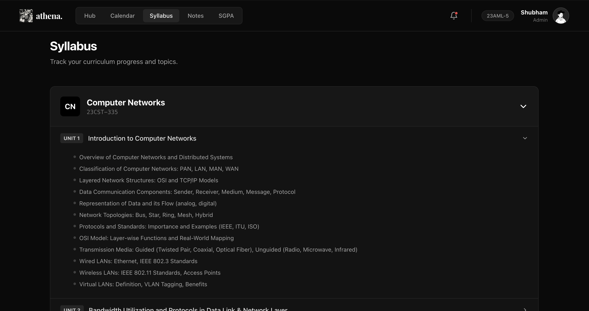
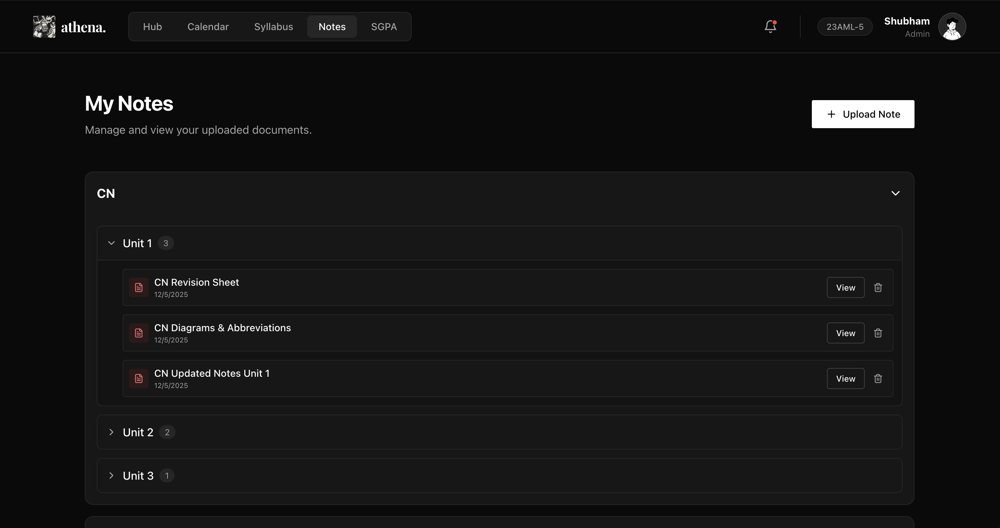
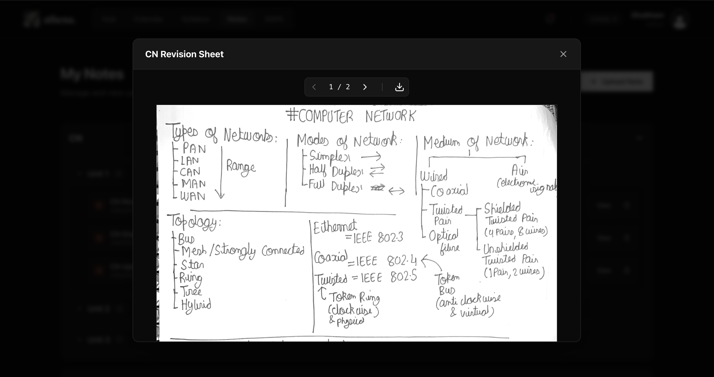

# Athena

<div align="center">
  
  <br />
  <h1>Your Digital Academic Companion</h1>
  <p>
    <strong>Build, connect, and scale intelligent workflows — all from one place.</strong>
  </p>
  <p>
    <a href="https://react.dev/">
      
    </a>
    <a href="https://vitejs.dev/">
      
    </a>
    <a href="https://tailwindcss.com/">
      
    </a>
    <a href="https://supabase.com/">
      
    </a>
  </p>
</div>

---

## 📖 Overview

**Athena** is a comprehensive academic management platform designed to streamline the student experience. It consolidates timetables, syllabus tracking, notes management, and academic performance calculation into a unified, modern interface. Built with performance and user experience in mind, Athena helps students stay organized and focused on their studies.

## ✨ Features

- **🏠 Smart Hub**: A centralized dashboard displaying your next class, upcoming exams, and motivational quotes to start your day.
- **📅 Dynamic Timetable**: visual weekly schedule to keep track of lectures and practicals.
- **📚 Syllabus Tracker**: Detailed breakdown of course subjects and units to monitor curriculum progress.
- **📝 Notes Management**: Upload, organize, and access study materials and revision sheets easily.
- **📄 Interactive PDF Viewer**: Built-in high-performance PDF viewer for reading notes directly within the app.
- **📊 SGPA Calculator**: Track your academic performance with an integrated Grade Point Average calculator.
- **🔐 Secure Authentication**: Robust student login and registration powered by Supabase Auth.
- **🎨 Modern UI/UX**: A dark-mode first design featuring 3D elements and smooth animations.

## 📸 Screenshots

### The Landing Page
<div align="center"> 
  
  <p><em>A modern landing page with 3D constellation backgrounds and sleek typography.</em></p>
</div>

### Student Hub
<div align="center">
  
  <p><em>Your personal command center: Next class reminders, exam countdowns, and daily schedule.</em></p>
</div>

### Syllabus Tracking
<div align="center">
  
  <p><em>Keep track of every topic and unit across all your subjects.</em></p>
</div>

### Notes Repository
<div align="center">
  
  <p><em>Organized storage for all your revision sheets, diagrams, and lecture notes.</em></p>
</div>

### PDF Viewer
<div align="center">
  
  <p><em>Seamlessly read and review your uploaded documents without leaving the platform.</em></p>
</div>

## 🛠 Tech Stack

### Frontend
- **Framework**: [React](https://react.dev/)
- **Build Tool**: [Vite](https://vitejs.dev/)
- **Styling**: [Tailwind CSS](https://tailwindcss.com/)
- **Icons**: [Lucide React](https://lucide.dev/)
- **3D Graphics**: [React Three Fiber](https://docs.pmnd.rs/react-three-fiber/) & [Drei](https://github.com/pmndrs/drei)
- **PDF Rendering**: [React-PDF](https://github.com/wojtekmaj/react-pdf)
- **Routing**: React Router DOM

### Backend
- **BaaS**: [Supabase](https://supabase.com/)
- **Database**: PostgreSQL
- **Authentication**: Supabase Auth
- **Storage**: Supabase Storage (for notes & PDFs)

## 🚀 Getting Started

Follow these steps to set up the project locally.

### Prerequisites
- Node.js (v18 or higher)
- npm or yarn

### Installation

1.  **Clone the repository**
    ```bash
    git clone https://github.com/yourusername/athena.git
    cd athena
    ```

2.  **Install dependencies**
    ```bash
    npm install
    ```

3.  **Configure Environment Variables**
    Create a `.env` file in the root directory and add your Supabase credentials:
    ```env
    VITE_SUPABASE_URL=your_supabase_project_url
    VITE_SUPABASE_ANON_KEY=your_supabase_anon_key
    ```

4.  **Database Setup**
    Run the SQL scripts provided in the root directory (e.g., `auth-schema.sql`, `supabase-setup.sql`) in your Supabase SQL Editor to set up the required tables and policies.

5.  **Run the development server**
    ```bash
    npm run dev
    ```

6.  **Open in Browser**
    Visit `http://localhost:5173` to view the application.

## 🤝 Contributing

Contributions are welcome! Please feel free to submit a Pull Request.

1.  Fork the project
2.  Create your feature branch (`git checkout -b feature/AmazingFeature`)
3.  Commit your changes (`git commit -m 'Add some AmazingFeature'`)
4.  Push to the branch (`git push origin feature/AmazingFeature`)
5.  Open a Pull Request

## 📄 License

This project is licensed under the MIT License - see the [LICENSE](LICENSE) file for details.

---

<div align="center">
  <sub>Built with ❤️ by Shubham Upadhyay</sub>
</div>

